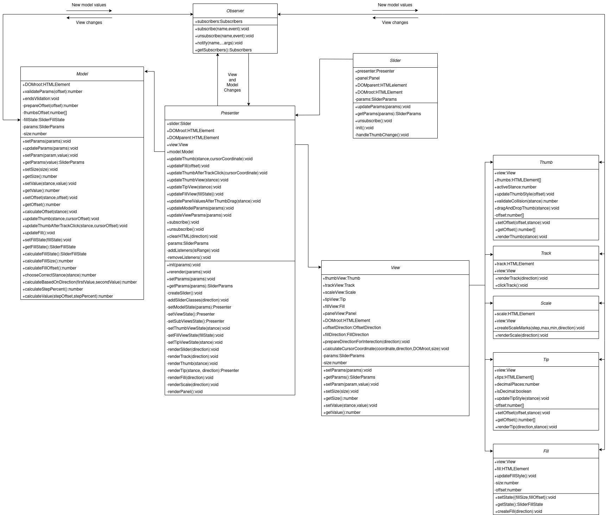

# slider-plugin

[Пример реализации](https://barghest0.github.io/slider-plugin/dist)


## Библиотеки

* Node - 16.13.1
* Typescript - 4.5.4
* JQuery - 3.6.0
* Webpack - 5.66.0
* SASS - 1.49.0
* Jest - 27.4.7
* Jsdom - 19.0.0
* Eslint(air-bnb) - 8.8.0

## Команды

Команды могут осуществлятсья с помощью `npm` или `yarn` пакетных менеджеров:

- Установка зависимостей - `npm i` или `yarn install`

- Запуск сервера для разработки - `npm run dev` или `yarn dev`

- Сборка проекта - `npm run build` или `yarn build`

- Деплой github pages - `npm run build` или `yarn build`

- Запуск тестов jest - `npm run test` или `yarn test`

- Процентное покрытие тестами - `npm run test:coverage` или `yarn test:coverage`

## Создание слайдера

Инициализация:

```javascript
import 'slider-plugin'

$('#slider').slider(params)
```

Пользовательские параметры:

| Параметр      | Тип                     | Значение по умолчанию | Описание                                           |
| ------------- | ----------------------- | --------------------- | -------------------------------------------------- |
| min           | number                  | 0                     | Минимальное значение                               |
| max           | number                  | 100                   | Максимальное значение                              |
| step          | number                  | 1                     | Шаг бегунка                                        |
| value         | number / number[]       | 0                     | Значение бегунков                                  |
| isRange       | boolean                 | false                 | Создание 2 бегунка                                 |
| idDecimal     | boolean                 | false                 | Добавление к значению десятичной части             |
| decimalPlaces | number                  | 0                     | Количество цифр после запятой                      |
| direction     | 'horizontal'/'vertical' | 'horizontal'          | Направление слайдера (горизонтальное/вертикальное) |
| hasScale      | boolean                 | true                  | Отображение шкалы                                  |
| hasTips       | boolean                 | true                  | Отображение подсказок над бегунками                |
| hasFill       | boolean                 | true                  | Отображение прогресс бара                          |
| panel         | boolean                 | false                 | Отображение контроль панели                        |


Альтернативный вариант установки параметров через `data` атрибуты:

```html
<div
  id="slider"
  class="slider"
  data-min-value="-100"
  data-is-range="true"
  data-first-value="-10"
  data-second-value="10"
></div>
```

## Архитектура

Архитектура плагина основана на [MVP](https://ru.wikipedia.org/wiki/Model-View-Presenter) шаблоне с passive view.
Приложение разделено на `Model`, `View`, `Presenter`, которые общаются между собой с помощью подписок, используя поведенческий паттерн [Observer](https://refactoring.guru/ru/design-patterns/observer).
`Presenter` - проводник между `Model` и `View`, в котором производятся подписки.
При изменении `View` происходит уведомление `Model`, которая в свою очередь производит нужные вычисления и уведомляет `View` и его дочерние элементы: `Fill`,`Panel`,`Scale`, `Thumb`,`Tip`,`Track`.


