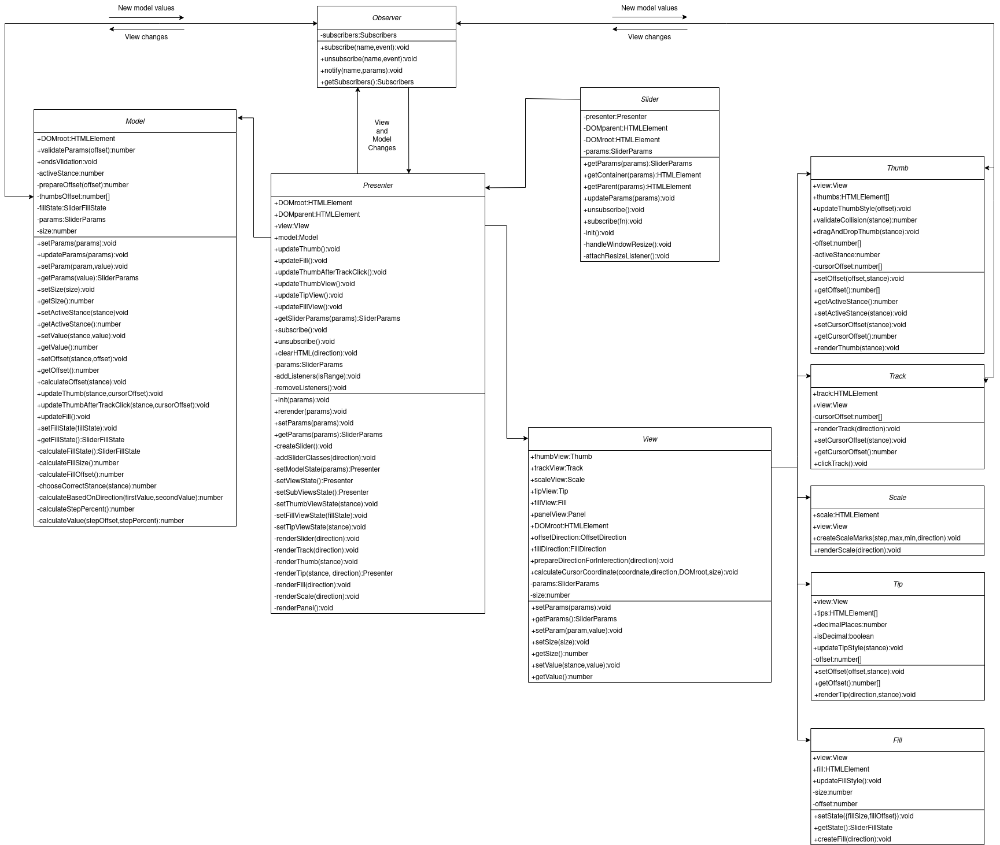

# slider-plugin

[Пример реализации](https://barghest0.github.io/slider-plugin/)

## Библиотеки

- Node - 16.13.1
- Npm - 8.3.0
- JQuery - 3.6.0
- Typescript - 4.5.4
- Webpack - 5.66.0
- SASS - 1.49.0
- Pug - 3.0.2
- Jest - 27.4.7
- Jsdom - 19.0.0
- ESlint(air-bnb, fsd) - 7.32.0

## Команды

Команды могут осуществляться с помощью `npm` или `yarn` пакетных менеджеров:

Установка зависимостей - `npm i` или `yarn`

Запуск ESlint - `npm run lint` или `yarn lint`

Запуск тестов jest - `npm run test` или `yarn test`

Процентное покрытие тестами - `npm run test:coverage` или `yarn test:coverage`

Запуск сервера для разработки - `npm run dev` или `yarn dev`

> Сборка запускается на локальной сервере по адресу http://localhost:8080, храниться в браузере в директории `dist`

Сборка проекта - `npm run build` или `yarn build`

> Продакшн сборка производится с помощью `webpack`, сохраняется в папке `dist`

## Создание слайдера

Инициализация:

```javascript
import 'slider-plugin';

$('#slider').slider(params);
```

Альтернативный вариант инициализации с помощь `data` атрибута `slider`

```html
<div data-slider="true"></div>
```

Пользовательские параметры:

| Параметр     | Тип                     | Значение по умолчанию | Описание                                           |
| ------------ | ----------------------- | --------------------- | -------------------------------------------------- |
| min          | number                  | 0                     | Минимальное значение                               |
| max          | number                  | 100                   | Максимальное значение                              |
| step         | number                  | 1                     | Шаг бегунка                                        |
| value        | number / number[]       | 0                     | Значение бегунков                                  |
| isRange      | boolean                 | false                 | Создание 2 бегунка                                 |
| direction    | 'horizontal'/'vertical' | 'horizontal'          | Направление слайдера (горизонтальное/вертикальное) |
| hasScale     | boolean                 | true                  | Отображение шкалы                                  |
| hasTips      | boolean                 | true                  | Отображение подсказок над бегунками                |
| hasFill      | boolean                 | true                  | Отображение прогресс бара                          |
| canThumbPush | boolean                 | false                 | Позволяет бегункам перемещать друг друга           |

Альтернативный вариант установки параметров через `data` атрибуты:

```html
<div
  id="slider"
  class="slider"
  data-min-value="-100"
  data-is-range="true"
  data-first-value="-10"
  data-second-value="10"
></div>
```

## API

После инициализации слайдера можно передать метод для взаимодействия со слайдером

```javascript
$('#slider').slider(params);
```

`$('#slider').slider('getParams')` - возвращает текущие параметры

```javascript
$('#slider').slider('getParams');
```

`$('#slider').slider('getContainer')` - возвращает элемент, на котором использован слайдер

```javascript
$('#slider').slider('getContainer');
```

`$('#slider').slider('getParent')` - возвращает родительский элемент контейнера, указанного выше

```javascript
$('#slider').slider('getParent');
```

`$('#slider').slider('updateParams', params)` - позволяет обновить текущие настройки слайдера

```javascript
$('#slider').slider('updateParams', params);
```

`$('#slider').slider('subscribe', someFunc)` - позволяет подписаться на изменение бегунка, возвращает значения бегунков `values` и параметры `params` в текущем положении

```javascript
const someFunc = (values, params) => {
  someAction(values);
};

$('#slider').slider('subscribe', someFunc);
```

`$('#slider').slider('unsubscribe')` - позволяет отписываться от событий слайдера

```javascript
$('#slider').slider('unsubscribe');
```

`$('#slider').slider('getSliderInstance')` - позволяет получить инстанс класса и взаимодействовать с плагином более удобным способом

```javascript
const $slider = $('#slider').slider('getSliderInstance');

$slider.getContainer();
$slider.getParams();

// ...
```

## Архитектура

Архитектура плагина основана на [MVP](https://ru.wikipedia.org/wiki/Model-View-Presenter) шаблоне с passive view.
Приложение разделено на `Model`, `View`, `Presenter`, которые общаются между собой с помощью подписок, используя поведенческий паттерн [Observer](https://refactoring.guru/ru/design-patterns/observer).
`Presenter` - проводник между `Model` и `View`, в котором производятся подписки.
При изменении `View` происходит уведомление `Model`, которая в свою очередь производит нужные вычисления и уведомляет `View` и его дочерние элементы: `Fill`,`Panel`,`Scale`, `Thumb`,`Tip`,`Track`.


